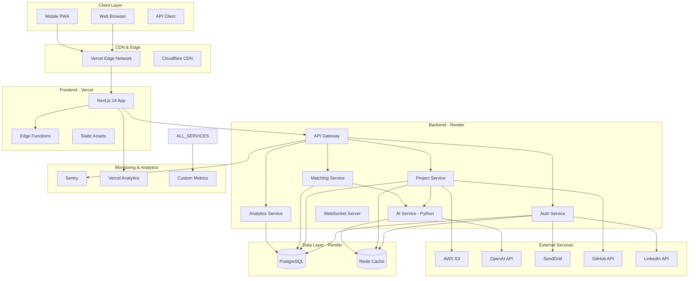

# System Architecture

InTransparency follows a modern microservices architecture optimized for scalability, maintainability, and cost-effectiveness using the Vercel + Render deployment strategy.

## 🏗️ High-Level Architecture



## 🌐 Frontend Architecture (Vercel)

### Next.js 14 App Router Structure
```
app/
├── (auth)/              # Authentication routes
├── dashboard/           # Main application  
│   ├── student/         # Student dashboard
│   ├── recruiter/       # Recruiter dashboard
│   ├── university/      # University dashboard
│   └── admin/           # Admin dashboard
├── api/                 # API routes (proxy)
├── layout.tsx           # Root layout
├── loading.tsx          # Global loading
├── error.tsx            # Global error handling
└── page.tsx             # Landing page
```

### Component Architecture
```
components/
├── ui/                  # Base UI components (shadcn/ui)
├── forms/               # Form components
├── layout/              # Layout components
├── dashboard/           # Dashboard-specific components
├── project/             # Project-related components
├── communication/       # Chat & messaging
├── search/              # Search & filtering
├── analytics/           # Analytics & charts
└── common/              # Shared components
```

### State Management Strategy
- **Server State**: React Query for API data
- **Client State**: Zustand for UI state
- **Form State**: React Hook Form
- **Auth State**: Context + Local Storage

## 🚀 Backend Architecture (Render)

### Node.js API Service
```
api/
├── controllers/         # Route handlers
├── middleware/          # Express middleware
├── models/              # Database models
├── routes/              # API routes
├── services/            # Business logic
├── utils/               # Utility functions
├── config/              # Configuration
└── websockets/          # WebSocket handlers
```

### Service Layer Pattern
- **Controllers**: Handle HTTP requests/responses
- **Services**: Business logic and data processing
- **Models**: Data access layer
- **Middleware**: Cross-cutting concerns

### API Design Principles
- **RESTful**: Standard HTTP methods and status codes
- **Consistent**: Uniform response format
- **Versioned**: /api/v1/ prefix for versioning
- **Documented**: OpenAPI/Swagger documentation
- **Secure**: Authentication and validation on all endpoints

## 🤖 AI Service Architecture (Python)

### FastAPI Service Structure
```
ai-service/
├── models/              # ML models and algorithms
├── services/            # AI processing services
├── api/                 # FastAPI routes
├── utils/               # Utility functions
├── config/              # Configuration
└── main.py              # FastAPI application
```

### AI Processing Pipeline
1. **Input Validation**: Validate and sanitize input data
2. **Preprocessing**: Clean and prepare data for analysis
3. **Model Inference**: Apply ML models for analysis
4. **Post-processing**: Format and enhance results
5. **Caching**: Store results for performance

### AI Services
- **Project Analyzer**: Analyze project complexity and innovation
- **Story Generator**: Create compelling project narratives
- **Matching Engine**: Find relevant connections and opportunities
- **Skill Extractor**: Identify and categorize technical skills
- **Quality Scorer**: Assess project quality and completeness

## 💾 Data Architecture

### Database Design (PostgreSQL)
```sql
-- Core entities
users
projects  
jobs
matches
universities
companies
professors

-- Analytics & tracking
project_analytics
user_activity
system_metrics

-- Communication
messages
conversations
notifications

-- Content management
skills_taxonomy
job_categories
university_programs
```

### Caching Strategy (Redis)
- **Session Data**: User sessions and auth tokens
- **API Responses**: Frequently accessed data
- **AI Results**: Cached analysis results
- **Real-time Data**: WebSocket connection state
- **Rate Limiting**: Request throttling data

### Data Flow Patterns
1. **Read-through Cache**: Check cache first, then database
2. **Write-through Cache**: Write to cache and database
3. **Cache Invalidation**: Intelligent cache eviction
4. **Database Replication**: Read replicas for performance

## 🔐 Security Architecture

### Authentication & Authorization
```
Authentication Flow:
1. User login → JWT token issued
2. Token stored in httpOnly cookie
3. Token validated on each request
4. Refresh token for token renewal

Authorization Layers:
- Route-level: Protect entire routes
- Resource-level: Protect specific resources  
- Field-level: Protect sensitive data fields
```

### Security Measures
- **Input Validation**: Joi schema validation
- **SQL Injection**: Parameterized queries
- **XSS Protection**: Content Security Policy
- **CSRF Protection**: CSRF tokens
- **Rate Limiting**: Request throttling
- **Data Encryption**: At rest and in transit

## 📡 Communication Architecture

### Real-time Features (WebSockets)
```javascript
// WebSocket event handling
socket.on('project-update', handleProjectUpdate)
socket.on('new-match', handleNewMatch)  
socket.on('message', handleMessage)
socket.on('notification', handleNotification)
```

### Event-Driven Architecture
- **Project Events**: Created, updated, analyzed
- **Match Events**: Found, accepted, rejected
- **User Events**: Login, profile update, activity
- **System Events**: Errors, performance metrics

## 🔄 Deployment Architecture

### Continuous Deployment Pipeline
```yaml
# GitHub Actions workflow
Trigger: Push to main/develop
Steps:
1. Run tests (frontend, backend, AI)
2. Build applications
3. Deploy to Vercel (frontend)
4. Deploy to Render (backend)
5. Run integration tests
6. Notify team of deployment status
```

### Environment Strategy
- **Development**: Local development environment
- **Staging**: Pre-production testing
- **Production**: Live production environment

### Scaling Strategy
- **Horizontal Scaling**: Multiple service instances
- **Database Scaling**: Read replicas and connection pooling
- **CDN Scaling**: Global content distribution
- **Caching Scaling**: Distributed Redis cache

## 📊 Monitoring & Observability

### Application Metrics
```javascript
// Key metrics tracked
- Response times (API, page loads)
- Error rates (4xx, 5xx errors)
- Throughput (requests per second)
- User engagement (page views, actions)
- Business metrics (signups, projects, matches)
```

### Logging Strategy
- **Structured Logging**: JSON format for easy parsing
- **Log Levels**: Error, warn, info, debug
- **Correlation IDs**: Track requests across services
- **Sensitive Data**: Scrub PII from logs

### Health Checks
- **Application Health**: Service status endpoints
- **Database Health**: Connection and query checks
- **External Service Health**: Third-party API status
- **Performance Health**: Response time thresholds

## 🌍 Global Architecture Considerations

### Multi-Region Strategy
- **Primary Region**: US East (Vercel/Render default)
- **CDN**: Global edge locations
- **Database**: Single region with backup strategy
- **Future**: Multi-region deployment for global scale

### Performance Optimization
- **Code Splitting**: Lazy load components
- **Image Optimization**: Next.js image optimization
- **API Optimization**: Response compression and caching
- **Database Optimization**: Indexing and query optimization

### Disaster Recovery
- **Database Backups**: Daily automated backups
- **Code Repository**: Git-based version control
- **Configuration**: Infrastructure as code
- **Recovery Procedures**: Documented recovery processes

## 🔮 Future Architecture Evolution

### Short-term Improvements
- **Enhanced Caching**: More aggressive caching strategy
- **API Gateway**: Centralized API management
- **Microservices**: Further service decomposition
- **Performance Monitoring**: More detailed metrics

### Long-term Vision
- **Multi-cloud**: Reduce vendor lock-in
- **Event Sourcing**: Comprehensive event history
- **Machine Learning Pipeline**: Advanced ML workflows
- **Global Distribution**: Multi-region deployment

---

This architecture provides a solid foundation for scaling InTransparency from startup to enterprise while maintaining performance, security, and cost-effectiveness.